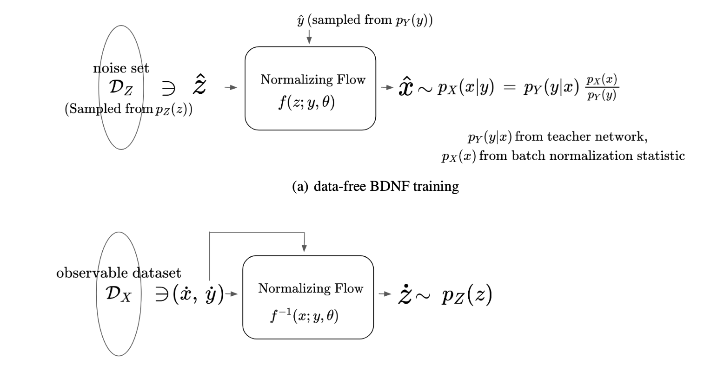
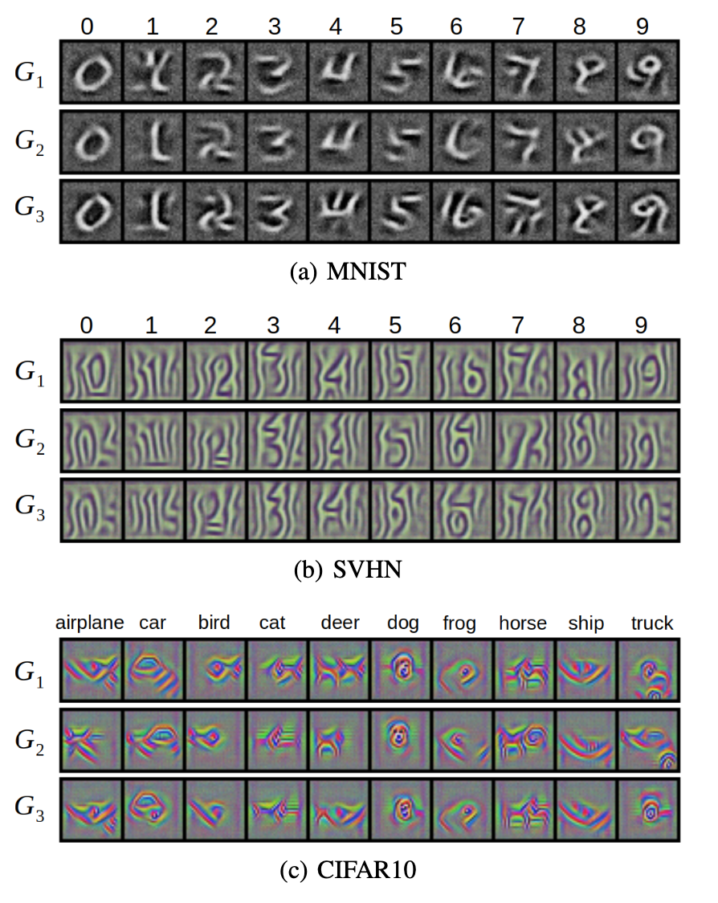
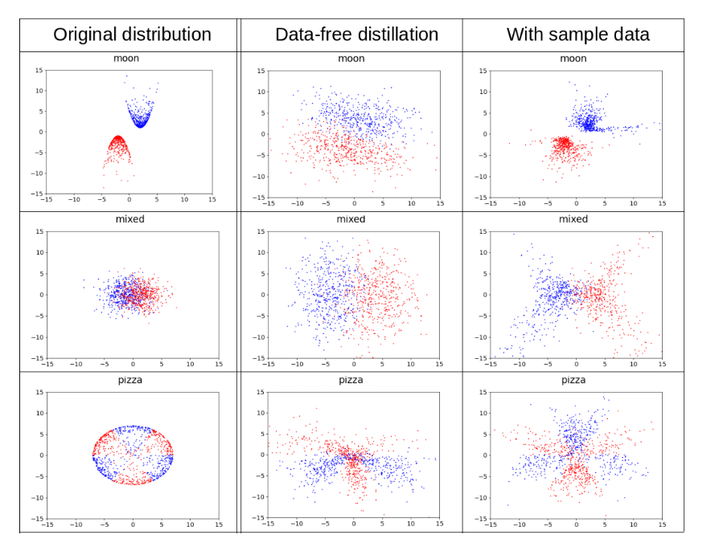

  # Knowledge Extraction Glow

## Insight

It is common to train Deep Neural Network with large data to classify it's label. The question is, is it also possible to re-generate training data only through trained model? And utilize re-generated data for something useful, for instance data-augmentation?

 

## Approach

 
Normalizing-flow is a type of generation model such as GAN/AutoEncoder. One of the feature that differentiate normalizing-flow is that data(x^) is 100% reversible with latent space (z^). Which means, if you know noise sample z^, you can re-generate original data x^. 

 

We combined Normalizing-flow with fully trained classifier model(MNIST classifier), and checked if we can train Normalizing-flow to generate distribution of original data(MNIST) without any training data. Also, we measured the performance of data-augmentation with regenerated data.

 

## Result

> **Point:** Normalizing-Flow is effectively re-generating distribution of original training data.

> **Point:** Re-generated data is somewhat effective training classifier model with data-agmentation.

 
 

we generated sample 2D-binary toy data(left), and trained classifier model to classify binary data. After fully training classifier model, we trained Normalizing flow to find original distribution of training data with classified model.
 
Re-generated distribution(middle), Re-generated distribution with a few number of original training data(right)

> **Point:** Normalizing flow can effectively infer distribution of original training data

 

## Experiment Setup

* Model Comparison/Training KeFlow

Check `/KeFlow/README.md`
 
 

* Experiment/Measurement of Teacher-Student model for KeFlow
 
Check `/teacher_student_experiment/README.md`
 
 

* 2D toy data simulation 

Check `/2d_toy_simulation/README.md`

 
 

## Paper
All detail of this research is in this paper.
[Data-free Knowledge Distillation with Bi-directional Normalizing Flow](BDNF_Paper.pdf)
